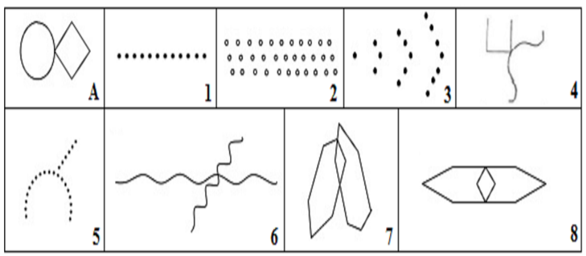

# Bender-Gestalt Test Dataset

## Executive Summary
The Bender-Gestalt Test (BGT), or Bender Visual-Motor Gestalt Test, is commonly used in pre-employment psychological assessments to evaluate candidates' cognitive and motor skills, particularly visual-motor integration. By reproducing geometric figures, candidates showcase their ability to process and organize visual information. The test can also identify potential neurological or developmental disorders, providing insights into cognitive and emotional functioning that may affect workplace performance.

The Bender-Gestalt Test dataset aims to automate the scoring process of pre-employment psychological assessments. This project addresses the time-consuming and subjective nature of manual BGT evaluations by creating a dataset to train machine learning models for automated scoring.

## Description of Data
The dataset comprises 20 participant records with:

### Scores:
- 14 scoring parameters
- Total scores
- Diagnosis
- 20 csv files containing the detail score calculation per participant

### Metadata:
- Age range: 22-57 years
- Nationalities: Argentine, Indian, American, Portuguese, Tunisian, Uruguayan
- Education levels: High School, Bachelor's Degree and Master's Degree

### Images:
- 20 images with the drawing of each participant

## Power Analysis
- H₀: There is no difference between manually and automatically scored Bender-Gestalt Test results.
- H₁: There is a significant difference between manually and automatically scored results.
- Statistical Test: Two-sample t-test for independent groups, comparing manual and automated scores.
- Effect Size: A large effect size of 0.8 is expected, based on Cohen’s recommendations.
- Statistical Significance Level and Power: Set at 0.05 and 0.80, respectively.
The recommended sample size is 52 participants; however, this dataset currently contains 20, representing a shortfall of 32 participants.

## Exploratory Data Analysis
### Dataset Overview:
The dataset consists of 20 records, each representing a participant's test results and demographic information:
- Mean Total Score: 2.65
- Most Common Diagnosis: Absence of brain impairment (14 cases)
- Borderline Cases: 5
- Strong Evidence for Brain Impairment: 1 case

### Visualizations:
- Bar chart for diagnosis: A bar chart was created to visualize the distribution of diagnoses, with the majority of participants having no brain impairment.
- Boxplot of Total Scores by Education Level: Shows how total scores vary across different education levels, providing insight into potential patterns related to cognitive skills and educational background.
- Boxplot of Total Scores by Previous Test Experience: Examines how prior experience with the test might influence scores, revealing differences between those who have taken the test before and those who have not.
- Most common error: A bar plot comparing the total value per error, showing which factors tend to have the most significant impact on the scores.

## Data Collection Protocol
Participants were recruited from Duke University and through social media to ensure broad outreach. Only candidates aged 18 and older were accepted. The data collection process involved the following steps:
1.	Google Form Completion: Participants filled out a Google Form that collects personal information, including age, nationality, highest level of education and whether they have previously taken the Bender-Gestalt Test.
2.	Drawing Task: Participants were instructed to copy the pattern drawing. They will also start a timer to record the time taken to complete the drawing.
3.	Image Upload: After completing the drawing, participants uploaded an image of their work through the Google Form.
4.	Data Storage: All collected data were stored in a Google Sheet linked to the Google Form.
5.	Scoring: Each participant's set of images was manually evaluated based on Lacks' Scoring System criteria outlined in the [scoring table](./dataset/standard/Scoring%20table%20criteria.png).

## Link to access

[Github Repository](https://github.com/iaravagni/Bender-Gestalt-dataset)

[Hugging Face Dataset](https://huggingface.co/datasets/iaravagni/BenderGestalt)

## Ethics Statement
This research ensure the privacy of participants. The key ethical considerations are:

- Informed Consent: All participants were fully informed about the purpose of the study, the data being collected, and how it would be used.

- Age Requirement: Only individuals aged 18 and older were included in the study.

- Minimal Data Collection: The dataset collects only the necessary information, such as demographic details (age, nationality, and education level) and participant drawings, to ensure that participants’ privacy is respected. Sensitive information is not included in the dataset.

- Confidentiality: All collected data is stored securely. Personal information is anonymized to protect participants’ identities.

- Voluntary Participation: Participation in the study was voluntary, and participants had the option to withdraw at any time without consequence. No incentive was provided for participation.

- Data Usage: The collected data will solely be used for research and academic purposes, including the development of machine learning models for automated Bender-Gestalt Test scoring. Any potential publication or sharing of results will be done without identifying individual participants.

## License
This project is released under the MIT License, permitting:
- Free use and modification
- Commercial use
- Distribution
- Integration with other software

